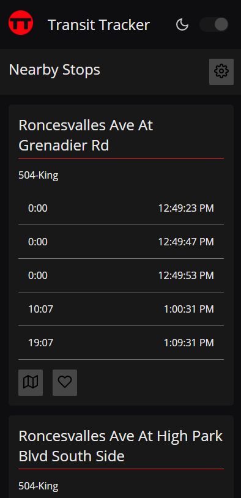

# transit-tracker

Transit Tracker is a react application that shows arrival times for TTC bus stops.


#### Deployment ####

Transit Tracker is built with create-react-app, it can be built with

```
> npm run build
```

a .env file that includes the variables shown in the .env.example file is necessary for the application to run

* REACT_APP_GOOGLEMAPS_KEY: a google maps api key, used for embedded maps
** REACT_APP_TTCAPI_HOST: a url for the TTC api, the nextbus api does not support https, so a [proxy function](https://gist.github.com/fischz/67cc54b79b1323b2bef9e51e3ac26348) will need to be set up to avoid mixed content policy violations 

#### Screenshots ####



